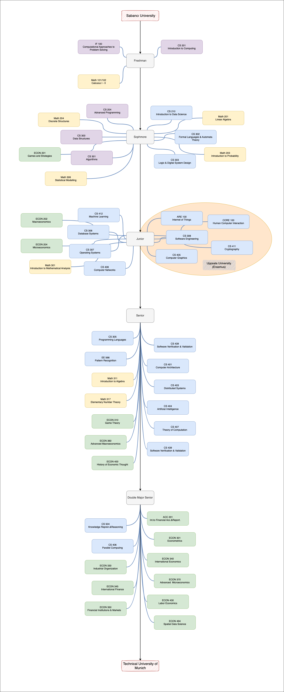

# Education

## [Technical University of Munich](https://www.tum.de/)

- **MSc. Informatics**

## [Sabanci University (2018 - 23)](https://www.sabanciuniv.edu/en)

- **BSc. Computer Science and Engineering**
  - Double Major in **Economics**
  - Minor in **Mathematics**
  - Sakip Sabanci High Honor Scholarship
  - GPA: 3.78
  - Erasmus at **Uppsala University, Sweden**

## Coursework

