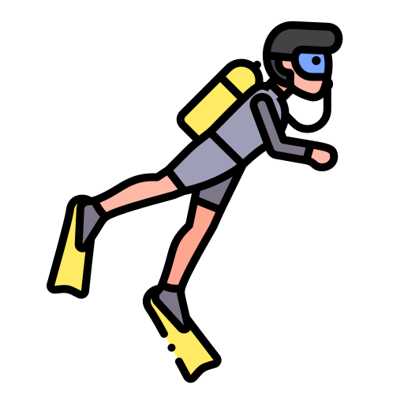

# Hello World :fontawesome-solid-hand-peace:

 

!!! note ""

    Hi, 
    
    I am a senior student at Sabanci University Computer Science & Engineering with a double major in Economics. And this is my personal website for projects, notes and future blogs :)

[Portfolio](/home){ .md-button .md-button--primary } 
[Blog](/developers-notebook){ .md-button .md-button--primary } 
[Notes](/awesome-bookmarks){ .md-button .md-button--primary }

